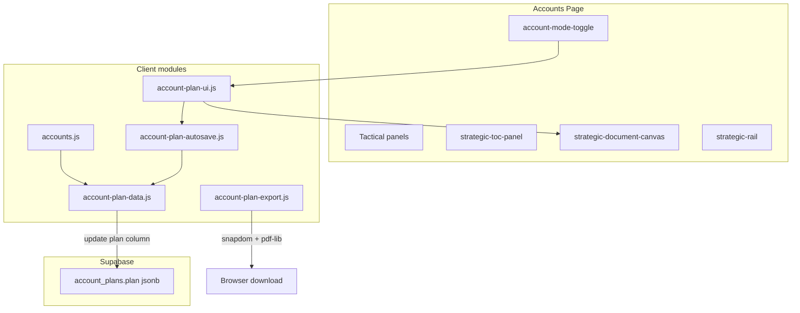

# Strategic Account Operating System

The Strategic Account OS is an embedded module on the Constellation CRM **Accounts** page. It adds a second “Strategic” view alongside the existing tactical CRM layout: a JSONB-backed account plan document with debounced autosave, 24-hour milestone snapshots, interactive planning canvas, version history, and PDF export.

**Primary files**

| Layer | Path |
|-------|------|
| SQL schema | `sql/account_plans.sql` |
| Manager RLS | `sql/rls_managers_manage_team_crm.sql` |
| Data layer | `js/account-plan-data.js` |
| Autosave engine | `js/account-plan-autosave.js` |
| Section registry | `js/account-plan-sections.js` |
| UI controller | `js/account-plan-ui.js` |
| Export templates | `js/account-plan-export-templates.js` |
| Export engine | `js/account-plan-export.js` |
| Page shell | `accounts.html` |
| Orchestrator | `js/accounts.js` |
| Styles | `input.css` / `output.css` |

---

## Architecture



---

## Database: `account_plans`

Run `sql/account_plans.sql` in Supabase after `public.accounts` exists. Re-run the manager block in `sql/rls_managers_manage_team_crm.sql` if managers need cross-rep access.

### Table shape

```sql
CREATE TABLE public.account_plans (
    id uuid PRIMARY KEY DEFAULT gen_random_uuid(),
    account_id bigint NOT NULL UNIQUE REFERENCES public.accounts(id) ON DELETE CASCADE,
    plan jsonb NOT NULL DEFAULT '{"schema_version":1,"current_draft":{},"history":[]}'::jsonb,
    created_at timestamptz NOT NULL DEFAULT now(),
    updated_at timestamptz NOT NULL DEFAULT now(),
    created_by uuid REFERENCES auth.users(id) ON DELETE SET NULL
);
```

- **One row per account** (`UNIQUE(account_id)`).
- Row deleted automatically when the parent account is deleted (`ON DELETE CASCADE`).
- RLS: owner policies join through `accounts.user_id = auth.uid()`.
- Managers: `account_plans_manager_all` via `is_manager()`.

---

## JSONB document schema (`plan` column)

Top-level structure:

```json
{
  "schema_version": 1,
  "current_draft": {
    "updated_at": "2026-05-19T12:00:00.000Z",
    "last_milestone_at": "2026-05-18T09:00:00.000Z",
    "sections": { }
  },
  "history": [ ]
}
```

### `current_draft` (live editable state)

All user edits are stored under `current_draft.sections`. Autosave updates `current_draft` and the row’s `updated_at` timestamp; it does not rewrite unrelated columns.

| Section key | Type | Purpose |
|-------------|------|---------|
| `pursuit_thesis` | string | Core pursuit rationale |
| `strategic_tensions` | string | Competing forces / constraints |
| `influence_mapping` | string | Stakeholders and power map |
| `competitive_landscape` | string | Incumbents and differentiation |
| `land_and_expand` | string | Wedge and expansion paths |
| `psychology` | object | Five 1–5 sliders (see below) |
| `relationship_momentum` | `{ score, narrative }` | 1–5 score + narrative |
| `plan_30_60_90` | `{ days_30, days_60, days_90 }` | Horizon plan text |

**Psychology sliders** (`psychology` object):

- `bureaucracy_level`
- `risk_appetite`
- `technical_sophistication`
- `vendor_loyalty`
- `decision_velocity`

Legacy section keys from early prototypes (`executive_summary`, `stakeholder_map`, etc.) are migrated into the new keys on read via `normalizePlan()` in `account-plan-data.js`.

### `history` (milestone snapshots)

Append-only array of committed snapshots. Each entry:

```json
{
  "id": "uuid",
  "committed_at": "2026-05-18T09:00:00.000Z",
  "reason": "auto_milestone",
  "label": "May 18, 2026 — Auto milestone",
  "snapshot": { }
}
```

| Field | Description |
|-------|-------------|
| `reason` | `auto_milestone` or `manual_force_commit` |
| `snapshot` | Deep copy of `current_draft` **at commit time** (before the in-flight edit that triggered the save after commit) |
| `label` | Human-readable timeline label |

**Design rules**

- History is capped at **50** entries (oldest trimmed client-side before write).
- Restore replaces `current_draft` from a snapshot and saves immediately **without** creating a new milestone.
- Lazy insert: first fetch for an account creates a default empty plan row.

---

## Autosave and milestones

Implemented in `account-plan-autosave.js` and `account-plan-data.js`.

### Debounced autosave (2 seconds)

1. Canvas `input` / `change` updates in-memory `_liveSections`.
2. `scheduleAutosave()` debounces for **2000 ms**.
3. On fire: `applyDraftToPlan()` merges sections, then `savePlanDraft()` updates the JSONB column.
4. Status chip (`#strategic-autosave-status`): `idle` → `pending` → `saving` → `saved` / `error`.

Autosave is cancelled on account switch or when leaving Strategic mode. It can be suppressed during history restore (`setAutosaveSuppressed`).

### 24-hour auto milestone

Before merging new edits, `shouldCreateMilestone()` returns true when:

```text
now - last_milestone_at >= 24 hours
```

`last_milestone_at` lives on `current_draft`; if missing, the last `history[].committed_at` is used as fallback.

When true (or on manual force commit), `commitMilestone()`:

1. Deep-clones `current_draft` into a new `history` entry.
2. Sets `current_draft.last_milestone_at` to the commit timestamp.
3. Applies the pending section merge.
4. Persists via Supabase update.

**Manual Force Commit** (`#plan-force-commit-btn`) calls the same path with `forceCommit: true` and `reason: manual_force_commit`.

---

## UI state: Tactical vs Strategic

### Mode toggle

- Button: `#account-mode-toggle` (sitemap icon).
- Body / `#accounts` class: `strategic-mode-active`.
- Preference: `localStorage.accounts_view_mode` = `tactical` | `strategic`.

| Mode | Left column | Main content | Right column |
|------|-------------|--------------|--------------|
| **Tactical** (default) | `.account-picker-panel` | `#account-details` (form, contacts, activities, deals) | Deals + proposals column |
| **Strategic** | `#strategic-toc-panel` | `#strategic-document-canvas` | `#strategic-rail` (widgets, export, versioning) |

### Guardrails

- Strategic mode requires a selected account (toggle disabled otherwise).
- Switching to Strategic with a dirty tactical account form shows an unsaved-changes confirm modal.
- Clearing account selection forces Tactical mode.

### Module responsibilities

| Module | Role |
|--------|------|
| `accounts.js` | Fetches plan in parallel with account details; owns `state.accountPlan` |
| `account-plan-ui.js` | Mode toggle, canvas render, rail, version popover, wires autosave + export |
| `account-plan-sections.js` | Section registry driving TOC, forms, and export inclusion flags |

---

## PDF export engine

Dependencies in `accounts.html`:

- `@zumer/snapdom` — DOM → canvas capture
- `pdf-lib@1.17.1` — PDF assembly and download

Hidden mount point: `#account-plan-export-root` (off-screen).

### Flow (`exportAccountPlanPdf(plan, account, type)`)

1. Build template via `buildDossierTemplate()` or `buildExecReadoutTemplate()`.
2. Append to `#account-plan-export-root`.
3. Wait two animation frames for layout settle.
4. Capture with `snapdom(element, { scale: 2, backgroundColor: '#ffffff' })` → PNG data URL.
5. Embed PNG in a new `PDFDocument` page via `pdf-lib`.
6. Trigger download: `{AccountName}_Strategic_{Dossier|Exec_Readout}.pdf`.
7. Clear export root DOM.

### The Dossier (portrait)

- Template width: **816 px** (8.5″ @ 96 DPI).
- Page height: **1056 px** (11″).
- PDF page size: US Letter (**612 × 792 pt**).
- Content: all sections with `exportDossier: true` — full text, psychology as static progress bars, momentum score, 30/60/90 grid.
- **Pagination**: section blocks are packed into fixed-height pages using a `scrollHeight` vs `clientHeight` measurement loop (same pattern as the proposals module).

### The Exec Readout (landscape slide)

- Template: **1056 × 594 px** (16∶9).
- PDF page: **841.89 × 473.56 pt** (16∶9).
- Content: Pursuit Thesis, Relationship Momentum score, top three psychology metrics, 30/60/90 bullets, optional Competitive Landscape excerpt — styled as a single presentation slide.

Export buttons in `#strategic-rail` use the live in-memory draft (including unsaved canvas edits).

---

## Deploy checklist

1. Run `sql/account_plans.sql` in Supabase SQL Editor.
2. Apply manager RLS patch from `sql/rls_managers_manage_team_crm.sql` if needed.
3. Deploy front-end assets (`accounts.html`, JS modules, CSS).
4. Run Playwright: `npm run test:e2e -- tests/e2e/accounts.functional.spec.ts`

---

## Testing

Playwright coverage in `tests/e2e/accounts.functional.spec.ts` (**Strategic Account OS** describe block):

- Mode toggle hides tactical panels and shows strategic shell.
- Canvas textarea edit cycles autosave chip through pending → saved.
- Force Commit adds a “Manual commit” entry in the version history popover.

Page object locators: `tests/pages/accounts.page.ts`.

---

## Future considerations

- Scroll-spy active section highlighting in the TOC.
- Manager “view as rep” verification in dedicated RLS integration tests.
- Server-side milestone enforcement (currently client-orchestrated).
- Additional export formats or Salesforce attachment upload.
