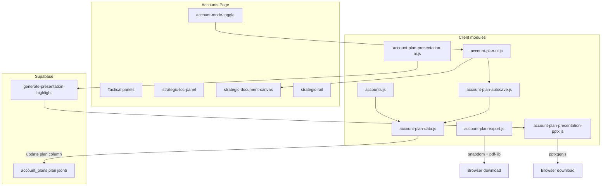

# Strategic Account Operating System

The Strategic Account OS is an embedded module on the Constellation CRM **Accounts** page. It adds a second “Strategic” view alongside the existing tactical CRM layout: a JSONB-backed account plan document (`schema_version: 2`) with debounced autosave, 24-hour milestone snapshots, interactive planning canvas (16 Elite Framework sections), version history, dossier PDF export, and executive PowerPoint export with optional AI highlight synthesis.

**Program coordination:** [docs/saos/PROJECT.md](./docs/saos/PROJECT.md) · **Agent status:** [docs/saos/STATUS.md](./docs/saos/STATUS.md)

**Primary files**

| Layer | Path |
|-------|------|
| SQL schema | `sql/account_plans.sql` |
| Manager RLS | `sql/rls_managers_manage_team_crm.sql` |
| Data layer | `js/account-plan-data.js` |
| Autosave engine | `js/account-plan-autosave.js` |
| Section registry | `js/account-plan-sections.js` |
| Shared contacts | `js/account-plan-contacts.js` |
| UI controller | `js/account-plan-ui.js` |
| Export templates | `js/account-plan-export-templates.js` |
| Export engine | `js/account-plan-export.js` |
| PPTX deck builder | `js/account-plan-presentation-pptx.js` |
| AI highlight client | `js/account-plan-presentation-ai.js` |
| Page shell | `accounts.html` |
| Orchestrator | `js/accounts.js` |
| Styles | `input.css` / `output.css` |

---

## Architecture



---

## Database: `account_plans`

Run `sql/account_plans.sql` in Supabase after `public.accounts` exists. Re-run the manager block in `sql/rls_managers_manage_team_crm.sql` if managers need cross-rep access.

### Table shape

```sql
CREATE TABLE public.account_plans (
    id uuid PRIMARY KEY DEFAULT gen_random_uuid(),
    account_id bigint NOT NULL UNIQUE REFERENCES public.accounts(id) ON DELETE CASCADE,
    plan jsonb NOT NULL DEFAULT '{"schema_version":2,"current_draft":{},"history":[]}'::jsonb,
    created_at timestamptz NOT NULL DEFAULT now(),
    updated_at timestamptz NOT NULL DEFAULT now(),
    created_by uuid REFERENCES auth.users(id) ON DELETE SET NULL
);
```

- **One row per account** (`UNIQUE(account_id)`).
- Row deleted automatically when the parent account is deleted (`ON DELETE CASCADE`).
- RLS: owner policies join through `accounts.user_id = auth.uid()`.
- Managers: `account_plans_manager_all` via `is_manager()`.

---

## JSONB document schema (`plan` column)

Top-level structure (`PLAN_SCHEMA_VERSION = 2` in `account-plan-data.js`):

```json
{
  "schema_version": 2,
  "current_draft": {
    "updated_at": "2026-05-19T12:00:00.000Z",
    "last_milestone_at": "2026-05-18T09:00:00.000Z",
    "sections": { }
  },
  "history": [ ]
}
```

### `current_draft` (live editable state)

All user edits are stored under `current_draft.sections`. Autosave updates `current_draft` and the row’s `updated_at` timestamp; it does not rewrite unrelated columns.

`normalizePlan()` on read migrates legacy v1 keys and `momentum_notes` into v2 shape. **`momentum_notes` is read-only legacy**; new events write to `interaction_log`.

### Section registry (16 sections)

Defined in `PLAN_SECTIONS` (`account-plan-sections.js`). Each section drives canvas render, TOC, and export flags (`exportDossier`, `exportExec`).

| Section key | Type | Purpose |
|-------------|------|---------|
| `account_snapshot` | account_snapshot | Hybrid CRM firmographics + plan judgments (tier, patience, priority, maturity, providers) |
| `pursuit_thesis` | composite_textarea | Core thesis, why account matters, cost of standing still, timing, executive narrative |
| `strategic_tensions` | pills_and_narrative | 9 either-or tension groups + narrative |
| `pain_signals` | pain_signals | Pain watchlist pills + notes |
| `critical_unknowns` | critical_unknowns | Open questions + executive language pills |
| `influence_mapping` | influence_board | Executive / mid-level / technical columns, political dynamics, access path |
| `white_space` | white_space_matrix | Framework-area opportunity rows (free-text value notes) |
| `competitive_landscape` | pills_and_narrative | Positioning pills + incumbents / narrative |
| `entrenchment` | entrenchment | Moat pills + compound relationships / displacement notes |
| `land_and_expand` | composite_textarea | Entry wedge, trust creation, expansion path |
| `entry_points` | entry_point_carousel | Per-contact pursuit playbooks (up to 5) |
| `psychology` | psychology_grid | Five 1–5 sliders + gravity pill fields + narrative |
| `relationship_momentum` | momentum | 1–5 score + narrative |
| `interaction_log` | interaction_log | Structured manual interaction entries (`source: manual`) |
| `momentum_timeline` | timeline_view | Unified timeline UI (quick-log signals + optional CRM overlay) |
| `plan_30_60_90` | triple_textarea | 30 / 60 / 90 horizon plan text |

**Psychology sliders** (`psychology` object): `bureaucracy_level`, `risk_appetite`, `technical_sophistication`, `vendor_loyalty`, `decision_velocity`.

Legacy v1 section keys (`executive_summary`, `stakeholder_map`, etc.) are migrated on read via `normalizePlan()`.

### `interaction_log`

Array of structured relationship events. Each entry includes:

| Field | Description |
|-------|-------------|
| `id` | UUID |
| `source` | `signal` (quick-log), `manual` (full form), or `activity` (promoted CRM activity) |
| `date` | ISO timestamp |
| `text` | Quick-log body (signals) |
| `interaction`, `key_insight`, … | Full-form fields (manual entries) |
| `activity_id` | CRM activity reference when `source: activity` |

**UX paths**

- **Quick log** — Relationship Timeline “Log Signal” → `source: signal` (no new `momentum_notes` writes).
- **Full form** — Interaction Log section “Add Interaction” → `source: manual`.
- **Promote** — Tactical activities “Promote” → `source: activity` + `activity_id`.

**Migrate-on-read:** existing `momentum_notes` entries are converted to `interaction_log` signal entries inside `normalizePlan()`.

### Signals-only export policy

**Locked product decision:** PDF dossier and PPTX exec deck export **signals and manual interactions only**. CRM activities (`source: activity`) appear in the canvas timeline when the overlay toggle is on, but are **excluded** from export via `getExportMomentumNotes()` / export template filters.

### `history` (milestone snapshots)

Append-only array of committed snapshots. Each entry:

```json
{
  "id": "uuid",
  "committed_at": "2026-05-18T09:00:00.000Z",
  "reason": "auto_milestone",
  "label": "May 18, 2026 — Auto milestone",
  "snapshot": { }
}
```

| Field | Description |
|-------|-------------|
| `reason` | `auto_milestone` or `manual_force_commit` |
| `snapshot` | Deep copy of `current_draft` **at commit time** |
| `label` | Human-readable timeline label |

**Design rules**

- History is capped at **50** entries (oldest trimmed client-side before write).
- Restore replaces `current_draft` from a snapshot and saves immediately **without** creating a new milestone.
- Lazy insert: first fetch for an account creates a default empty plan row.

---

## Autosave and milestones

Implemented in `account-plan-autosave.js` and `account-plan-data.js`.

### Debounced autosave (2 seconds)

1. Canvas `input` / `change` updates in-memory `_liveSections`.
2. `scheduleAutosave()` debounces for **2000 ms**.
3. On fire: `applyDraftToPlan()` merges sections, then `savePlanDraft()` updates the JSONB column.
4. Status chip (`#strategic-autosave-status`): `idle` → `pending` → `saving` → `saved` / `error`.

Autosave is cancelled on account switch or when leaving Strategic mode. It can be suppressed during history restore (`setAutosaveSuppressed`).

### 24-hour auto milestone

Before merging new edits, `shouldCreateMilestone()` returns true when:

```text
now - last_milestone_at >= 24 hours
```

When true (or on manual force commit), `commitMilestone()` deep-clones `current_draft` into `history`, updates `last_milestone_at`, merges pending edits, and persists.

**Manual Force Commit** (`#plan-force-commit-btn`) uses `reason: manual_force_commit`.

---

## UI state: Tactical vs Strategic

### Mode toggle

- Button: `#account-mode-toggle` (sitemap icon).
- Body / `#accounts` class: `strategic-mode-active`.
- Preference: `localStorage.accounts_view_mode` = `tactical` | `strategic`.

| Mode | Left column | Main content | Right column |
|------|-------------|--------------|--------------|
| **Tactical** (default) | `.account-picker-panel` | `#account-details` (form, contacts, activities, deals) | Deals + proposals column |
| **Strategic** | `#strategic-toc-panel` | `#strategic-document-canvas` | `#strategic-rail` (widgets, export, versioning) |

### Guardrails

- Strategic mode requires a selected account (toggle disabled otherwise).
- Switching to Strategic with a dirty tactical account form shows an unsaved-changes confirm modal.
- Clearing account selection forces Tactical mode.

---

## Export engine

Dependencies in `accounts.html`:

- `@zumer/snapdom` — DOM → canvas capture
- `pdf-lib@1.17.1` — PDF assembly
- `pptxgenjs` — PowerPoint deck assembly

Hidden mount point: `#account-plan-export-root` (off-screen).

### Dossier PDF (`#plan-export-dossier-btn`)

`exportAccountPlanPdf(plan, account, 'dossier')`:

1. Build template via `buildDossierTemplate()` — all sections with `exportDossier: true`.
2. Capture with snapdom, assemble US Letter PDF, trigger download.
3. Includes structured `interaction_log` block; timeline uses signals-only filter.

Portrait **816 × 1056 px** template; measured pagination for long sections.

### Executive PowerPoint (`#plan-export-exec-btn`)

`handleExportPdf('exec')`:

1. Optionally call Supabase edge function `generate-presentation-highlight` (Gemini) for a three-slide highlight reel.
2. Build deck via `generateExecPresentationPptx()` — sections with `exportExec: true`, client fallbacks when AI unavailable.
3. Download `{AccountName}_Strategic_Exec_Readout.pptx`.

Export buttons enable when a plan row is loaded (`_planRowId`). Both exports use the live in-memory draft (including unsaved canvas edits).

Generating overlay: `#plan-export-generating-overlay`.

---

## Deploy checklist

1. Run `sql/account_plans.sql` in Supabase SQL Editor.
2. Apply manager RLS patch from `sql/rls_managers_manage_team_crm.sql` if needed.
3. Deploy front-end assets (`accounts.html`, JS modules, CSS).
4. Deploy `supabase/functions/generate-presentation-highlight` for AI exec decks (optional; fallbacks work offline).
5. Run Playwright: `npm run test:e2e -- tests/e2e/accounts.functional.spec.ts`

---

## Testing

Playwright coverage in `tests/e2e/accounts.functional.spec.ts` (**Strategic Account OS** describe block):

- Mode toggle hides tactical panels and shows strategic shell.
- Account snapshot tier select cycles autosave chip through pending → saved.
- Quick-log signal appears on Relationship Timeline and autosaves.
- Export dossier / exec / force-commit buttons enabled when plan loaded.
- Canvas textarea edit (pursuit thesis) cycles autosave chip through pending → saved.
- Force Commit adds a “Manual commit” entry in the version history popover.

Page object locators: `tests/pages/accounts.page.ts`.

---

## Future considerations

- Scroll-spy active section highlighting in the TOC.
- Manager “view as rep” verification in dedicated RLS integration tests.
- Server-side milestone enforcement (currently client-orchestrated).
- Salesforce attachment upload for exported artifacts.
