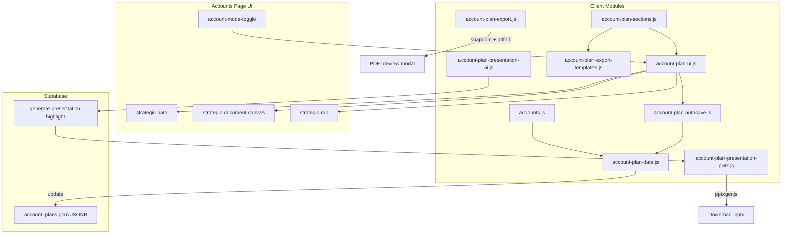

# Strategic Account OS (SAOS) — External Review Brief

**Purpose:** Give a third-party LLM (e.g. Gemini Pro) a crystal-clear, code-grounded picture of the Strategic Account Operating System built inside Constellation CRM — so you can **challenge, scrutinize, and help us improve** the product, data model, UX psychology, and export/AI pipeline.

**Audience:** Expert reviewer with no repo access. Treat this document as the source of truth for *intent* and *implementation*; cite specific section IDs and file paths when proposing changes.

**Last synced to codebase:** 2026-06-01 (`deploy` branch)

---

## Table of Contents

1. [Executive Summary](#1-executive-summary)
2. [Product Philosophy](#2-product-philosophy)
3. [Where SAOS Lives](#3-where-saos-lives)
4. [User Journeys & Mode Model](#4-user-journeys--mode-model)
5. [Workspace Layout (Current UI)](#5-workspace-layout-current-ui)
6. [Architecture & File Map](#6-architecture--file-map)
7. [Persistence: Supabase & JSONB Schema](#7-persistence-supabase--jsonb-schema)
8. [Section Registry (All 15 Canvas Sections)](#8-section-registry-all-15-canvas-sections)
9. [Core vs Deep Dive View Modes](#9-core-vs-deep-dive-view-modes)
10. [Canvas Rendering by Section Type](#10-canvas-rendering-by-section-type)
11. [Cross-Cutting UX Patterns](#11-cross-cutting-ux-patterns)
12. [Right Rail Widgets](#12-right-rail-widgets)
13. [Autosave, Milestones & Version History](#13-autosave-milestones--version-history)
14. [Export Pipeline (PDF + PowerPoint)](#14-export-pipeline-pdf--powerpoint)
15. [AI Presentation Highlight (Gemini)](#15-ai-presentation-highlight-gemini)
16. [Interaction Log (Data-Only Section)](#16-interaction-log-data-only-section)
17. [Tactical UX Labels vs Stable Data Keys](#17-tactical-ux-labels-vs-stable-data-keys)
18. [Testing Coverage](#18-testing-coverage)
19. [Known Gaps, Doc Drift & Intentional Tradeoffs](#19-known-gaps-doc-drift--intentional-tradeoffs)
20. [Challenge Questions for the Reviewer](#20-challenge-questions-for-the-reviewer)

---

## 1. Executive Summary

**Strategic Account OS (SAOS)** is an embedded module on the Constellation CRM **Accounts** page. It gives enterprise sales reps a structured **Strategic Account Plan** — not a free-form note, but a JSONB-backed document organized around an **Elite Strategic Enterprise Pursuit Framework** (15 interactive canvas sections + 1 data-only interaction log).

### What reps get

| Capability | Description |
|------------|-------------|
| **Dual mode** | Toggle between **Tactical** (standard CRM: form, contacts, activities, deals) and **Strategic** (full-screen planning workspace) |
| **Structured capture** | Pill toggles, influence Kanban, white-space matrix, psychology sliders, entry-point dossiers, 30/60/90 horizons, etc. |
| **Core / Deep Dive** | Progressive disclosure: Core hides 4 “framework depth” sections; Deep Dive shows all 15 |
| **Autosave** | 2-second debounced writes to Supabase |
| **Version history** | Auto milestones every 24h + manual Force Commit; restore without creating new milestones |
| **PDF dossier** | Measured pagination export of filled sections (Smart Drop omits empty) |
| **Exec PowerPoint** | Client-side deck via pptxgenjs, optionally AI-synthesized via Gemini edge function |
| **Relationship timeline** | Quick-log signals + optional CRM activity overlay (export policy differs — see §14) |

### What SAOS is *not*

- Not a standalone app — it is a view mode inside `accounts.html`
- Not a generic CRM replacement — tactical data (contacts, activities) feeds Strategic views but Strategic is the planning layer
- Not a real-time collaborative editor — last write wins; no optimistic locking
- Not a stored AI artifact — presentation highlights are synthesized at export time only

---

## 2. Product Philosophy

SAOS is designed around **sales psychology**, not just data collection. Key beliefs encoded in code comments and UX:

### 2.1 Confrontational clarity over journal entries

- **The Big Play** (`pursuit_thesis`) merged legacy “core thesis” + “cost of standing still” into one field because reps duplicated prose. The merged `thesis` field asks: *“Why is their status quo broken, and why are we the only logical fix right now?”*
- **The Blindspots** (`critical_unknowns`) replaced a giant paragraph with a **one-line-per-question checklist** — shaped like a discovery-call prep list, not an anxiety journal.
- **Insight Density nudge**: textareas in `pursuit_thesis` and `competitive_landscape` show a soft visual cue when content exceeds ~400 characters — long prose degrades downstream AI/PPTX synthesis.

### 2.2 Forced linkage between strategy and execution

- **Strategic tension ghost** (read-only) appears inside **30/60/90 Plan** and **Land & Expand** sections, reminding reps which competing priorities they selected upstream. It **never writes back** to data — only mutates a ghost host node to avoid focus-loss / autosave loops.
- **Land & Expand linkage prompt**: *“How does our Land & Expand strategy resolve your identified tension: …?”*

### 2.3 Contacts vs opportunities separation

- **Entry points** = contact dossiers (who to approach, how, with what narrative). Max 5.
- **White space** = opportunity rows (named deals/expansion areas with framework scoring).
- Entry points deliberately have **no opportunity name field** — opportunities live exclusively on white space rows.

### 2.4 Signals vs CRM noise in exports

- Canvas timeline can show CRM activities when toggled on.
- **PDF and PowerPoint exports include signals and manual interactions only** — not promoted CRM activities. This is a locked product decision.

### 2.5 Progressive disclosure (Core vs Deep Dive)

Core mode hides psychology, competing priorities, blindspots, and incumbent grip — the “framework depth” sections reps may skip on first pass. Deep Dive exposes the full pursuit operating system.

---

## 3. Where SAOS Lives

| Surface | Path / Element |
|---------|----------------|
| Page shell | `accounts.html` |
| Orchestrator | `js/accounts.js` — loads plan, calls `initStrategicMode()` |
| UI controller | `js/account-plan-ui.js` (~4,800 lines) |
| Section registry | `js/account-plan-sections.js` |
| Data layer | `js/account-plan-data.js` |
| Autosave | `js/account-plan-autosave.js` |
| Export | `js/account-plan-export.js`, `js/account-plan-export-templates.js` |
| PPTX | `js/account-plan-presentation-pptx.js` |
| AI client | `js/account-plan-presentation-ai.js` |
| Edge function | `supabase/functions/generate-presentation-highlight/index.ts` |
| Live styles | `css/saos-strategic.css` (cache-busted on deploy) |
| Source styles | `input.css` → compiled `output.css` |
| SQL | `sql/account_plans.sql` |
| Internal architecture doc | `PLAN.md` (partially stale — see §19) |
| Program status | `docs/saos/STATUS.md` |

---

## 4. User Journeys & Mode Model

### 4.1 Two orthogonal axes

```
                    ┌─────────────────────────────────────┐
                    │         ACCOUNTS PAGE               │
                    └─────────────────────────────────────┘
                                      │
              ┌───────────────────────┴───────────────────────┐
              │                                               │
        TACTICAL MODE                                   STRATEGIC MODE
   (#account-details visible)                    (#strategic-workspace visible)
   Account picker visible                        Account picker HIDDEN
   Standard CRM panels                           Path nav + canvas + rail
              │                                               │
              │                                    ┌──────────┴──────────┐
              │                                    │                     │
              │                              CORE VIEW            DEEP DIVE VIEW
              │                           (11 sections)           (15 sections)
              │                           1 path row                2 path rows
              └──────────────── Toggle (#account-mode-toggle) ──────┘
```

### 4.2 Persistence of mode preferences

| Preference | Storage key | Values |
|------------|-------------|--------|
| Tactical vs Strategic | `localStorage.accounts_view_mode` | `tactical` \| `strategic` |
| Core vs Deep Dive | `localStorage.saos-view-mode` | `core` \| `deep` |

Body/classes: `strategic-mode-active` on `#accounts` and `document.body` when Strategic.

### 4.3 Guardrails

- Strategic toggle **disabled** until an account is selected.
- Switching to Strategic with a **dirty tactical form** triggers discard confirmation.
- Clearing account selection **forces Tactical** and cancels pending autosave.
- First plan fetch for an account **lazy-creates** an empty `account_plans` row.

### 4.4 Typical Strategic session

1. Select account (while in Tactical) → toggle Strategic.
2. Workspace renders: header (account title + Core/Deep Dive toggle) → horizontal Path → scrollable canvas (card-wrapped sections) → right rail.
3. Edit fields → `_liveSections` updated in memory → 2s debounced autosave to Supabase.
4. Navigate via Path chevrons (click jumps; scroll-spy highlights active section).
5. Optional: Force Commit milestone, restore from version popover, export PDF/PPTX.

**Account switching in Strategic:** User must toggle back to Tactical (account picker is hidden in Strategic mode by design).

---

## 5. Workspace Layout (Current UI)

Recent UX (Option A: **Path + scroll**, deployed on `deploy` branch):

```
┌──────────────────────────────────────────────────────────────────────────────┐
│  [Account Name — Strategic Plan]    [View Mode: Core | Deep Dive]   [🕐 Ver] │
├──────────────────────────────────────────────────────────────────────────────┤
│  PATH (nested chevron steps — scroll-spy active step highlighted)           │
│  Core:     [Snap][Big Play][Pain]...[Timeline]  (1 row, equal width)       │
│  Deep:     [Row 1: 8 sections interlocking chevrons]                         │
│            [Row 2: 8 sections interlocking chevrons]                         │
├───────────────────────────────────────────────┬──────────────────────────────┤
│  SCROLLABLE CANVAS (max ~1080px inner)        │  RIGHT RAIL (320px)          │
│  ┌─────────────────────────────────────────┐  │  • Plan Completeness         │
│  │ CARD: Account Snapshot                  │  │  • Relationship Momentum     │
│  └─────────────────────────────────────────┘  │  • Next 30 Days preview      │
│  ┌─────────────────────────────────────────┐  │  • Export PDF / PPTX         │
│  │ CARD: The Big Play                      │  │  • Force Commit              │
│  └─────────────────────────────────────────┘  │                              │
│  ... (one card per visible section)           │                              │
└───────────────────────────────────────────────┴──────────────────────────────┘
```

### DOM structure (`accounts.html`)

| Element | ID / class | Role |
|---------|------------|------|
| Workspace root | `#strategic-workspace` | Hidden until Strategic mode |
| Header | `.strategic-workspace-header` | Title + view mode + version trigger |
| View mode host | `#strategic-view-mode-host` | Core / Deep Dive toggle |
| Path nav | `#strategic-path` > `#strategic-path-track` | Horizontal section steps |
| Canvas | `#strategic-document-canvas` | Scroll container |
| Inner | `.strategic-document-inner` | Flex column of section cards |
| Rail | `#strategic-rail` | Widgets + export + versioning |
| Export mount | `#account-plan-export-root` | Off-screen templates for PDF capture |

### Legacy elements (intentionally dead)

- `#strategic-toc-nav` / `#strategic-toc-body` — left-rail TOC, always hidden; superseded by Path.

---

## 6. Architecture & File Map



### Runtime data flow (edit loop)

1. User edits canvas control → event handler mutates `_liveSections[sectionKey]`.
2. `queueAutosave()` schedules flush after **2000ms** debounce.
3. `sanitizeDraftSectionsForPersistence()` coerces psychology sliders + strips empty tension pills.
4. `applyDraftToPlan()` merges into `_planBaseline.current_draft.sections`.
5. `savePlanDraft()` writes JSONB to Supabase; may append milestone if 24h elapsed.
6. Autosave chip (`#strategic-autosave-status`) cycles: `idle → pending → saving → saved | error`.

**Export uses live draft:** `handleExportPdf` calls `syncLiveSectionsFromCanvas()` so exports include **unsaved edits** in the DOM.

---

## 7. Persistence: Supabase & JSONB Schema

### 7.1 Table

```sql
-- sql/account_plans.sql
CREATE TABLE public.account_plans (
    id uuid PRIMARY KEY DEFAULT gen_random_uuid(),
    account_id bigint NOT NULL UNIQUE REFERENCES public.accounts(id) ON DELETE CASCADE,
    plan jsonb NOT NULL DEFAULT '{"schema_version":2,"current_draft":{},"history":[]}'::jsonb,
    created_at timestamptz NOT NULL DEFAULT now(),
    updated_at timestamptz NOT NULL DEFAULT now(),
    created_by uuid REFERENCES auth.users(id) ON DELETE SET NULL
);
```

- **One row per account** (`UNIQUE(account_id)`).
- RLS: owner via `accounts.user_id = auth.uid()`; managers via `is_manager()`.

### 7.2 Document shape (`PLAN_SCHEMA_VERSION = 2`)

```json
{
  "schema_version": 2,
  "current_draft": {
    "updated_at": "ISO-8601",
    "last_milestone_at": "ISO-8601 | null",
    "sections": { }
  },
  "history": [ ]
}
```

Constants (`account-plan-data.js`):

| Constant | Value | Meaning |
|----------|-------|---------|
| `PLAN_SCHEMA_VERSION` | `2` | Current schema |
| `HISTORY_CAP` | `50` | Max milestone snapshots (client-side trim before write) |
| `MILESTONE_INTERVAL_MS` | `86400000` (24h) | Auto milestone interval |
| `MAX_ENTRY_POINTS` | `5` | Max entry point dossiers |

### 7.3 All section keys under `current_draft.sections`

| Key | Normalized shape | In `PLAN_SECTIONS`? |
|-----|------------------|---------------------|
| `account_snapshot` | Object: tier, relationship_status, ai_cloud_maturity, strategic_patience, pursuit_priority, existing_providers, expansion_potential | ✅ |
| `pursuit_thesis` | Object: thesis, action_forcing_event, why_account_matters, timing, executive_narrative | ✅ |
| `strategic_tensions` | `{ selected_pills: string[], narrative }` — either-or enforced | ✅ (Deep Dive only in UI) |
| `pain_signals` | `{ selected: string[], notes }` | ✅ |
| `critical_unknowns` | `{ blindspots: string[] }` | ✅ (Deep Dive only in UI) |
| `influence_mapping` | `{ executive[], mid_level[], technical[], invisible_org_chart, political_dynamics, access_path: {current,desired,bridge,strategy} }` | ✅ |
| `white_space` | `WhiteSpaceRow[]` | ✅ |
| `competitive_landscape` | `{ incumbents, positioning_pills[], narrative }` | ✅ |
| `entrenchment` | `{ compound_relationships, moat_pills[], difficult_to_remove }` | ✅ (Deep Dive only in UI) |
| `entry_points` | `EntryPoint[]` (max 5) | ✅ |
| `psychology` | 5 sliders (1–5, default 3) + gravity text fields + narrative | ✅ (Deep Dive only in UI) |
| `relationship_momentum` | `{ score: 1–5, narrative }` | ✅ |
| `land_and_expand` | `{ initial_entry, trust_creation, expansion_path }` | ✅ |
| `plan_30_60_90` | `{ days_30, days_60, days_90, client_commitments: string[] }` (max 12 commitments) | ✅ |
| `momentum_timeline` | *(no dedicated data key — UI reads `interaction_log` + CRM activities)* | ✅ |
| `interaction_log` | `InteractionLogEntry[]` | ❌ **Data only — no canvas registry entry** |
| `momentum_notes` | `{ id, date, text }[]` | ❌ **Legacy read-only** — migrated to `interaction_log` on read |

### 7.4 Normalization highlights (`normalizePlan()`)

- **Migrate-on-read** from v1 keys: `executive_summary`, `stakeholder_map`, `situation_assessment`, etc.
- `migrateMomentumNotesToInteractionLog()` — legacy notes → `source: 'signal'`.
- `normalizeCriticalUnknowns()` — prefers `blindspots[]`; splits legacy `unknowns` text into lines; drops `executive_language_pills`.
- `normalizeEntryPoint()` — merges legacy field pairs; drops `tired_of_hearing`.
- `enforceEitherOrPills()` on strategic tensions — **only one pill per either-or group survives**.
- `normalizeWhiteSpace()` — drops rows where **all** fields empty.

### 7.5 Pre-save sanitization (`sanitizeDraftSectionsForPersistence()`)

Runs on autosave flush only:

- Psychology sliders → integer 1–5.
- `strategic_tensions.selected_pills` → strip empty strings.

---

## 8. Section Registry (All 15 Canvas Sections)

Defined in `PLAN_SECTIONS` (`js/account-plan-sections.js`). Order below = canvas order = Path order.

| # | `id` | UI Title | `type` | Export PDF | Export PPTX | Core visible? |
|---|------|----------|--------|:----------:|:-----------:|:-------------:|
| 1 | `account_snapshot` | Account Snapshot | `account_snapshot` | ✅ | ✅ | ✅ |
| 2 | `pursuit_thesis` | **The Big Play** | `composite_textarea` | ✅ | ✅ | ✅ |
| 3 | `strategic_tensions` | **Competing Priorities** | `pills_and_narrative` | ✅ | ❌ | ❌ Deep Dive |
| 4 | `pain_signals` | Pain Signals | `pain_signals` | ✅ | ❌ | ✅ |
| 5 | `critical_unknowns` | **The Blindspots** | `blindspots_list` | ✅ | ❌ | ❌ Deep Dive |
| 6 | `influence_mapping` | Influence Mapping | `influence_board` | ✅ | ❌ | ✅ |
| 7 | `white_space` | White Space | `white_space_matrix` | ✅ | ✅ | ✅ |
| 8 | `competitive_landscape` | Competitive Landscape | `pills_and_narrative` | ✅ | ✅ | ✅ |
| 9 | `entrenchment` | **The Incumbent's Grip** | `entrenchment` | ✅ | ❌ | ❌ Deep Dive |
| 10 | `entry_points` | Strategic Entry Points | `entry_point_carousel` | ✅ | ❌ | ✅ |
| 11 | `psychology` | **How They Buy** | `psychology_grid` | ✅ | ✅ | ❌ Deep Dive |
| 12 | `relationship_momentum` | Relationship Momentum | `momentum` | ✅ | ✅ | ✅ |
| 13 | `land_and_expand` | Land & Expand | `composite_textarea` | ✅ | ✅ | ✅ |
| 14 | `plan_30_60_90` | 30 / 60 / 90 Plan | `triple_textarea` | ✅ | ✅ | ✅ |
| 15 | `momentum_timeline` | Relationship Timeline | `timeline_view` | ✅ | ❌ | ✅ |

**Counts:** 15 registry sections. Core view = **11**. Deep Dive = **15**.

### 8.1 Strategic tension groups (9 either-or)

IDs: `scale_reliability`, `innovation_governance`, `cost_agility`, `cloud_control`, `automation_oversight`, `speed_stability`, `agility_compliance`, `centralization_flexibility`, `build_buy`.

Each group presents two opposing pills; rep selects **at most one side per group** (enforced on normalize).

### 8.2 Psychology sliders

| ID | Label | Scale semantics |
|----|-------|-----------------|
| `bureaucracy_level` | Bureaucracy Level | inverse (high = warn) |
| `risk_appetite` | Risk Appetite | direct |
| `technical_sophistication` | Technical Sophistication | direct |
| `vendor_loyalty` | Vendor Loyalty | direct |
| `decision_velocity` | Decision Velocity | direct |

Default value: **3** (neutral). “Filled” detection for rail completeness treats unmoved sliders (still 3) as unfilled unless gravity fields or narrative have content.

### 8.3 Entry point fields (`ENTRY_POINT_FIELD_KEYS`)

`contact_id`, `contact_name`, `why_they_matter`, `operational_pain`, `trust_level`, `responsiveness`, `political_influence`, `conversation_wedge`, `mutual_connections`, `next_move`, `comm_style`, `compound_potential`, `human_context`.

**Assignment model:** Contacts assigned via influence board drag-and-drop (auto-stubs entry point). No contact picker dropdown in entry point card — read-only contact label + hidden input.

### 8.4 White space row fields

`name`, `area`, `opportunity`, `operational_importance`, `executive_visibility`, `confidence`, `value_notes`.

`area` uses framework pills from `WHITE_SPACE_AREAS`. Row `name` is the editable opportunity label (e.g. “Flagship SD-WAN Pilot”).

### 8.5 Client commitments (inside `plan_30_60_90`)

Array `client_commitments[]`, max 12 entries. UX label: **Client Commitments (The Give/Get)** via `formatClientCommitmentsLabel()`.

---

## 9. Core vs Deep Dive View Modes

### Hidden in Core (`SAOS_CORE_HIDDEN_SECTION_IDS`)

```javascript
['psychology', 'strategic_tensions', 'critical_unknowns', 'entrenchment']
```

Implementation:

- Canvas: CSS `#strategic-document-canvas.saos-mode-core #strategic-section-{id} { display: none }`
- Path: `getCanvasPlanSections()` filters registry
- Rail completeness: denominator = visible sections only (changes with mode)

### Path layout differences

| Mode | Structure | CSS class |
|------|-----------|-----------|
| Core | 1 row × 11 equal-width chevrons | `strategic-path-track--core` |
| Deep Dive | 2 rows × ~8 chevrons each (`Math.ceil(n/2)` split) | `strategic-path-track--deep` |

Deep Dive HTML structure:

```html
<ol id="strategic-path-track" class="strategic-path-track strategic-path-track--deep">
  <li class="strategic-path-row">
    <ol class="strategic-path-row-track"><!-- sections 1–8 --></ol>
  </li>
  <li class="strategic-path-row">
    <ol class="strategic-path-row-track"><!-- sections 9–15 --></ol>
  </li>
</ol>
```

Each row is an independent nested chevron chain (flat left on first step, flat right on last step of that row).

### Path navigation mechanics

- **Scroll-spy:** listens on canvas scroll; active section = last section whose top ≤ canvas top + 64px.
- **Click:** smooth-scrolls section into view (12px offset); 900ms scroll-lock prevents spy flicker.
- **Labels:** full titles, no ellipsis truncation; text wraps inside chevrons.

---

## 10. Canvas Rendering by Section Type

Built by `buildCanvasHtml()` → `paintCanvas()` in `account-plan-ui.js`. Each section wrapped via `wrapStrategicSection()` with classes `strategic-section strategic-section-card`.

| `type` | What the rep sees |
|--------|---------------------|
| `account_snapshot` | CRM read-only firmographics (name, industry, employees, sites, address) + plan judgment fields (tier pills, maturity, patience, priority) + providers textarea |
| `composite_textarea` | Multi-field auto-expanding textareas with hint asides |
| `pills_and_narrative` | Toggle pills + narrative textarea(s); split layout for competing priorities |
| `pain_signals` / `entrenchment` | Pill watchlist + notes textarea |
| `blindspots_list` | Add/remove one-line checklist items |
| `influence_board` | Drag-drop Kanban: bench → executive / mid_level / technical; contact cards with metadata pills; org chart / political / access path text areas |
| `white_space_matrix` | Dynamic rows with editable name, area pills, importance/visibility/confidence pills, value notes |
| `psychology_grid` | 5 range sliders + Enterprise Gravity text fields + narrative |
| `momentum` | 1–5 slider + narrative |
| `triple_textarea` | 30/60/90 horizon cards + Client Commitments bullet list |
| `timeline_view` | Quick-log textarea + “Log Signal” button; optional CRM activities toggle; vertical timeline tree |
| `entry_point_carousel` | Tab per entry point; read-only contact; profile/context/narrative/human_context panels |

### Partial re-render paths (no full `paintCanvas`)

Some interactions rebuild **only** a section’s innerHTML to preserve focus elsewhere:

- `refreshEntryPointsSection()`
- `refreshInfluenceSection()`
- `refreshWhiteSpaceSection()`
- `refreshPlan306090Section()`
- `refreshInteractionLogSection()` *(orphaned — see §16)*

These replace innerHTML inside the existing `<section>` element — card wrapper classes persist on the outer element.

---

## 11. Cross-Cutting UX Patterns

### 11.1 Strategic tension ghost

| Constant | Value |
|----------|-------|
| `TENSION_GHOST_SECTIONS` | `['plan_30_60_90', 'land_and_expand']` |
| `TENSION_LINKAGE_PROMPTS.land_and_expand` | Accountability question linking to selected tensions |

Ghost renders selected tensions as *“X over Y”* phrasing from either-or groups. **Read-only. Never writes to `strategic_tensions`.**

### 11.2 Influence → entry point pipeline

Dragging a contact from influence bench onto a tier column can **auto-stub** an entry point dossier (`ensureEntryPointForContact`). Keeps `contact_id` synchronized.

### 11.3 Section cards (canvas)

Each section renders inside a card container:

- Rounded border, subtle background, light shadow
- Section title with bottom divider
- Vertical gap between cards in `.strategic-document-inner`

### 11.4 Insight density cue

Fields in `pursuit_thesis` and `competitive_landscape` show visual nudge when content exceeds ~400 characters.

---

## 12. Right Rail Widgets

Rendered by `renderRail()` into `#strategic-rail`:

| Card | Content | Data source |
|------|---------|-------------|
| **Plan Completeness** | % bar, “filled / total sections” | `computePlanCompleteness()` over **visible** sections |
| **Relationship Momentum** | Score badge 1–5 + label (Stalled→Champion) + 120-char narrative preview | `relationship_momentum` |
| **Next 30 Days** | Rich-text-stripped preview of `plan_30_60_90.days_30` | `plan_30_60_90` |
| **Export** | PDF dossier button, PowerPoint exec button | Disabled until `_planRowId` set |
| **Versioning** | Force Commit button + 24h auto-milestone help text | `commitMilestone()` |

Version history popover: `#plan-version-trigger` in header (not in rail) → `#plan-version-popover` with restore actions.

---

## 13. Autosave, Milestones & Version History

### Autosave (`account-plan-autosave.js`)

| Parameter | Value |
|-----------|-------|
| Debounce | **2000ms** |
| Status states | `idle`, `pending`, `saving`, `saved`, `error` |
| Cancel triggers | Account switch, leave Strategic mode |
| Suppress | During history restore |

### Milestones

| Trigger | `reason` value |
|---------|----------------|
| 24h since `last_milestone_at` | `auto_milestone` |
| Force Commit button | `manual_force_commit` |

Each history entry:

```json
{
  "id": "uuid",
  "committed_at": "ISO",
  "reason": "auto_milestone | manual_force_commit",
  "label": "Human-readable label",
  "snapshot": { /* deep copy of current_draft at commit time */ }
}
```

**Restore:** replaces `current_draft` from snapshot, saves immediately, **does not** create a new milestone.

**Cap:** 50 entries — oldest trimmed client-side before write. **No server-side enforcement.**

---

## 14. Export Pipeline (PDF + PowerPoint)

### Dependencies (loaded in `accounts.html`)

- `@zumer/snapdom` — DOM → PNG rasterization
- `pdf-lib@1.17.1` — PDF assembly
- `pptxgenjs@3.12.0` — PowerPoint generation

### 14.1 PDF Plan Summary (Dossier)

Flow: `handleExportPdf('dossier')` → `buildDossierTemplate()` → `paginateDossierSections()` → Snapdom (scale **2**) → pdf-lib US Letter → **PDF preview modal** (not direct download).

**Smart Drop:** Sections empty per `isPlanSectionEmptyForExport()` are omitted entirely — no placeholder pages.

**Section grouping:** `DOSSIER_SECTION_GROUPS = [['pain_signals', 'critical_unknowns', 'entrenchment']]` — paginator treats trio as atomic unit (deal-context block).

**Pagination rules (`account-plan-export.js`):**

- Measured off-screen in `#account-plan-export-root`
- `PAGINATION_SAFETY_BUFFER_PX = 0` (non-zero buffer previously caused ~50-page runaway)
- Removed `contain: paint` on export content box ( broke `scrollHeight` measurement in Chrome)
- `psychology` always starts a new page
- `entry_points`: up to 3 profiles per page with rebalancing
- Oversized sections split at panel/stack boundaries
- Debug: `window.__APP_PAGINATION_DEBUG__ = true`

**Client Commitments:** Rendered as dedicated dossier subsection with Give/Get qualifier styling.

### 14.2 PowerPoint Exec Readout

Flow: `handleExportPdf('exec')` → optional `fetchPresentationHighlight()` → `generateExecPresentationPptx()` → direct download `{AccountName}_Strategic_Exec_Readout.pptx`.

Physical slides (approximate):

1. Cover
2. Executive Summary / Situation
3. Psychology & Competing Priorities (Smart Drop if empty)
4. Battlefield (competitive, white space, influence, entry points)
5. Execution Roadmap (30/60/90, commitments, signals, entrenchment moat)

**Note:** AI returns a **3-slide JSON schema** (`situation`, `battlefield`, `execution`) but PPTX maps that into **more physical slides** — not 1:1.

### 14.3 Signals-only export policy (locked)

`getExportMomentumNotes()` / export templates:

| `interaction_log.source` | In canvas timeline? | In PDF/PPTX? |
|--------------------------|:--------------------:|:------------:|
| `signal` (quick-log) | ✅ | ✅ |
| `manual` (full form) | ✅ | ✅ |
| `activity` (promoted CRM) | ✅ (if overlay on) | ❌ |
| Legacy `momentum_notes` | Migrated on read | ✅ (as signals) |

---

## 15. AI Presentation Highlight (Gemini)

### Edge function

`supabase/functions/generate-presentation-highlight/index.ts`

| Setting | Value |
|---------|-------|
| Primary model | `gemini-2.5-flash` |
| Fallback | `gemini-2.0-flash` |
| Output | JSON matching `PresentationHighlight` schema |
| Storage | **None** — synthesized at export time only |

### Client

`js/account-plan-presentation-ai.js`:

- `fetchPresentationHighlight()` — calls edge function
- `normalizePresentationHighlight()` — extensive fallbacks from raw plan if AI fails

On AI failure: warning toast, deck still generates from plan fallbacks.

### System prompt constraints (summary)

- Boardroom tone; headlines first; bullets max ~12 words
- Maps all v2 section keys to 3-slide JSON (`situation`, `battlefield`, `execution`)
- **Mandatory signals-only rule** for `execution.signals`
- Does not invent facts; labels gaps when sparse

### PPTX consumer

`js/account-plan-presentation-pptx.js` merges AI highlight + raw plan context into slide layouts with Smart Drop for empty psychology/tensions blocks.

---

## 16. Interaction Log (Data-Only Section)

`interaction_log` is **persisted in JSONB** but **not registered in `PLAN_SECTIONS`**.

### Intended UX paths (from data layer design)

| Path | `source` | UI entry |
|------|----------|----------|
| Quick log | `signal` | Relationship Timeline → “Log Signal” ✅ **Active** |
| Full form | `manual` | Interaction Log section → “Add Interaction” ❌ **Unreachable** |
| Promote CRM | `activity` | Tactical activities → “Promote” ✅ **Active** |

**Dead code:** `buildInteractionLogFormHtml()`, `refreshInteractionLogSection()`, `saveInteractionForm()` exist but no registry entry mounts the full form on canvas. Comment in data layer: *“Interaction Log UI is deprecated.”*

### Timeline section (`momentum_timeline`)

- Reads `interaction_log` + optional CRM activities overlay
- Quick-log writes new `source: signal` entries
- Export uses signals only regardless of CRM overlay state

---

## 17. Tactical UX Labels vs Stable Data Keys

Display copy in `TACTICAL_UX_LABELS` — **data keys never change**:

| Label key | User-facing string | Stable data key |
|-----------|-------------------|-------------------|
| `pursuitThesis` | The Big Play | `pursuit_thesis` |
| `actionForcingEvent` | Action-Forcing Event (Why Now?) | `pursuit_thesis.action_forcing_event` |
| `psychologySection` | How They Buy | `psychology` |
| `competingPriorities` | Competing Priorities | `strategic_tensions` |
| `humanContext` | The Off-the-Record Read | `entry_points[].human_context` |
| `incumbentGrip` | The Incumbent's Grip | `entrenchment` |
| `clientCommitments` + qualifier | Client Commitments (The Give/Get) | `plan_30_60_90.client_commitments` |

Section id `critical_unknowns` retained for AI/export compatibility; UI title is **The Blindspots**.

---

## 18. Testing Coverage

**File:** `tests/e2e/accounts.functional.spec.ts`  
**Page object:** `tests/pages/accounts.page.ts`

| Test | Validates |
|------|-----------|
| Mode toggle | Strategic workspace + canvas visible |
| Canvas edit autosave | `pursuit_thesis.thesis` → pending → saved |
| Account snapshot tier | Tier select → autosave |
| Log signal + autosave | Timeline signal appears + saves |
| Export buttons enabled | PDF, PPTX, Force Commit enabled after plan load |
| Force Commit | Manual commit appears in version popover |

**Run:** `npm run test:e2e -- tests/e2e/accounts.functional.spec.ts`

**Not covered (gaps):** Core/Deep Dive toggle, scroll-spy, PDF/PPTX byte generation, influence drag, version restore, AI highlight, card layout, two-row path.

---

## 19. Known Gaps, Doc Drift & Intentional Tradeoffs

### Documentation drift (challenge us on keeping docs honest)

| Claim | Reality |
|-------|---------|
| `PLAN.md` says **16 registry sections** | `PLAN_SECTIONS.length === **15**`; `interaction_log` is data-only |
| `PLAN.md` lists `interaction_log` as canvas section | No registry entry; full form UI orphaned |
| `PLAN.md` links `docs/saos/PROJECT.md` | **File does not exist** |
| `PLAN.md` says scroll-spy is future work | **Implemented** in Path nav |
| `PLAN.md` `critical_unknowns` type = `critical_unknowns` | Actual type = `blindspots_list` |
| `PLAN.md` pursuit_thesis still mentions separate `cost_of_standing_still` | Merged into `thesis` |
| `docs/saos/STATUS.md` “16/16 sections” | Should be 15 canvas + 1 data-only log |
| Export-templates comment references `docs/saos/DECISIONS.md` | **File does not exist** |

### Architectural challenge points

1. **Interaction log split brain** — data model supports manual full-form entries; UI path is dead. Is quick-log-only the final design?
2. **Client-only milestones** — 24h auto-commit and 50-cap enforced in browser, not Postgres.
3. **No optimistic locking** — concurrent edits to same account plan = last write wins.
4. **Either-or tension enforcement** — silent drop of multi-select within a group on normalize.
5. **White space row deletion** — all-empty rows disappear on normalize; may surprise reps mid-edit.
6. **Completeness metric mode dependency** — Core vs Deep changes denominator; same plan gets different % scores.
7. **Export vs canvas timeline parity** — CRM activities visible on canvas but excluded from exports by design.
8. **AI schema vs PPTX slide count** — 3-slide JSON ≠ physical slide count; mapping is implicit in pptx builder.
9. **Pagination fragility** — zero safety buffer; long sections depend on split heuristics.
10. **Account picker hidden in Strategic** — must toggle to Tactical to switch accounts; intentional but friction-heavy.
11. **Service worker caching** — deploy requires `sw.js` `CACHE_VERSION` bump + CSS query string or clients serve stale JS/CSS.

---

## 20. Challenge Questions for the Reviewer

Use these as prompts for critique. We want **specific, actionable** feedback — not generic “add more tests.”

### Product & UX

1. Is **Core vs Deep Dive** the right split? Should any of the 4 hidden sections move to Core, or should Core be renamed to avoid implying “complete”?
2. Does hiding the account picker in Strategic mode help focus, or create unacceptable friction for multi-account reps?
3. Are **section cards** sufficient visual separation, or should we add sticky sub-nav, collapsible sections, or progress indicators per card?
4. Is the **two-row Deep Dive path** (8+8) the right information architecture, or should rows follow semantic grouping (e.g. Situation row / Execution row)?
5. Is **ghost tension linkage** strong enough to prevent 30/60/90 plans that ignore competing priorities?

### Data model

6. Should `interaction_log` get a **registry entry** again, or should manual-form fields be deleted from the schema?
7. Is `{ blindspots: string[] }` the right shape for discovery prep, vs prioritized/ranked unknowns with severity?
8. Should **either-or tensions** allow “undecided” per group explicitly, vs implicit empty?
9. Is merging thesis + cost of standing still still right, or did we lose nuance reps need?

### Export & AI

10. Is **signals-only export** defensible to executives who expect full activity history in the dossier?
11. What should the **AI highlight schema** optimize for — 3 conversational slides vs faithful plan mirror?
12. Where will measured PDF pagination break next (long influence boards, many white space rows, huge entry point dossiers)?

### Technical

13. What server-side constraints should exist (milestone enforcement, schema validation, row-level versioning)?
14. Should completeness scoring weight sections by strategic importance, not binary filled/unfilled?
15. What E2E scenarios are highest ROI before next customer pilot?

---

## Appendix A: Quick Reference — Hidden CSS / Debug Hooks

| Hook | Purpose |
|------|---------|
| `body.strategic-mode-active` | Strategic workspace unlocked |
| `#strategic-document-canvas.saos-mode-core` | Core section hiding |
| `#strategic-document-canvas.saos-mode-deep` | All sections visible |
| `window.__APP_PAGINATION_DEBUG__ = true` | PDF pagination trace logging |
| `localStorage.accounts_view_mode` | `tactical` \| `strategic` |
| `localStorage.saos-view-mode` | `core` \| `deep` |

---

## Appendix B: Section Order (Path + Canvas)

```
 1. account_snapshot
 2. pursuit_thesis          (The Big Play)
 3. strategic_tensions      (Competing Priorities)      [Deep Dive only]
 4. pain_signals
 5. critical_unknowns       (The Blindspots)            [Deep Dive only]
 6. influence_mapping
 7. white_space
 8. competitive_landscape
 9. entrenchment            (The Incumbent's Grip)      [Deep Dive only]
10. entry_points
11. psychology               (How They Buy)              [Deep Dive only]
12. relationship_momentum
13. land_and_expand
14. plan_30_60_90
15. momentum_timeline        (Relationship Timeline)
```

---

*End of review brief. When proposing changes, reference section IDs and file paths above so the Constellation team can trace recommendations to implementation.*
